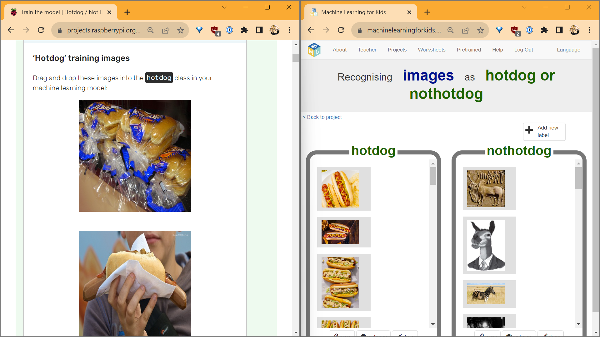
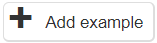
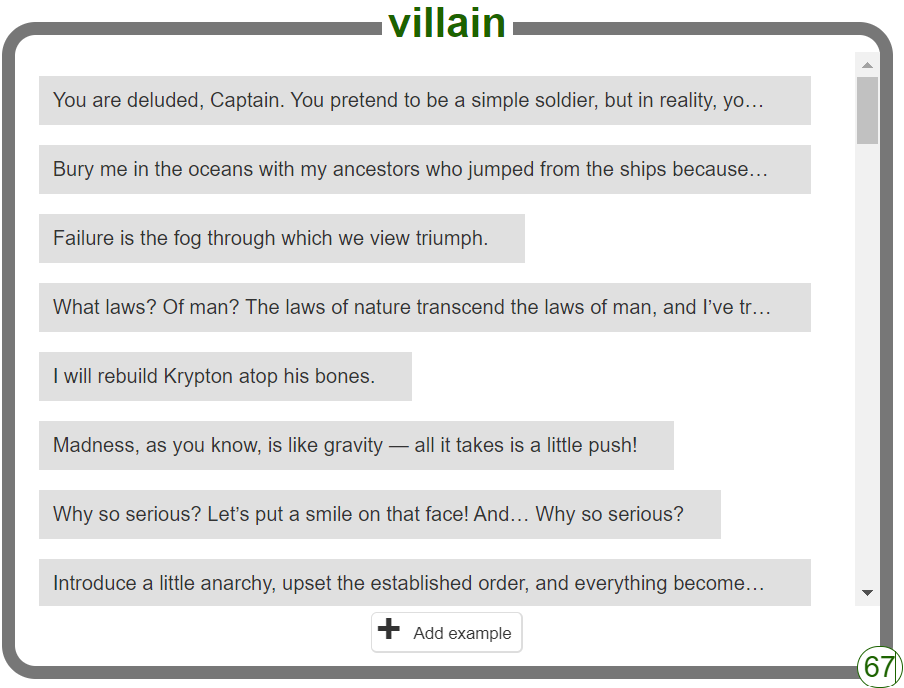
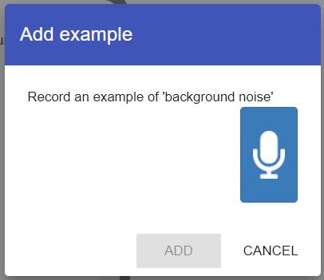
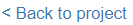

## Adding training images with Drag & Drop

To 'drag and drop' images into your classes easily, you can set up the windows on your screen side-by-side by clicking on and dragging the tab you are working on to one side of the screen:

Once you have set your screen up like this, you can simply just click on the training images you want to use and drag them into the right class, then release the mouse button:

## Adding training text snippets

Look in your favourite books, or search online for quotes from famous heroes. In your `hero` class, click `Add Example` and paste or type in the quotes one at a time. 

Repeat this process a number of times until you have collected a bank of quotes you are happy with. The more quotes you have for each class, the more accurate your model will be.

## Adding training audio

<strong>Remember:</strong>  

8 is the very lowest number of samples each class can have to create a working model. If you have less than this in any class, you won't be able to train the model.

You should aim for **around 10-15 samples in each class**, but again - the more **training data** you add to your model at this stage, the more accurate it will be at recognising the different sounds.

Inside the class you're adding data to, click `Add Example`. 

---

Record a sample of sound by clicking the microphone. Remember, **you can only record a maximum of 2 seconds** in each sample.

---

When you have enough samples in each class, select **Back to project**.

<strong>Some tips for recording your voice</strong>   

Imagine you're teaching a new word to a friend from another country. Sometimes you might say the word slowly and clearly, and other times you might say it quickly or in your everyday speaking style. This helps your friend understand the word no matter how it's said. Recording your voice for the audio classifier is similar!

Find a Quiet Spot: Just like finding the best place to teach your friend the new word, pick a spot where there's no background noise. This helps the computer focus on just your voice.

Speak Clearly... But Not Always: Start by saying "left", "right", "up", and "down" very clearly. But also, mix it up! Sometimes say them quickly, or the way you'd say them in a regular conversation. This teaches the computer to recognize the words even when they're not perfectly pronounced.

Hold the Mic Steady: If you're using a microphone or a phone, hold it steady, about a hand's length away from your mouth. A headset mic shouldn't touch your face when you speak. Think of it as the "listening ear" that's eager to learn!

Not Too Loud, Not Too Soft: Speak at a normal volume. Imagine you're chatting with your friend at the park – not too shouty, but not whispering secrets either.

Do a Test Run: Before diving in, record a short clip and listen to it. If you can understand yourself, the computer probably can too!

By giving the computer a mix of clear and everyday pronunciations, it'll be ready to understand you in the real world, no matter how you say the words. 

